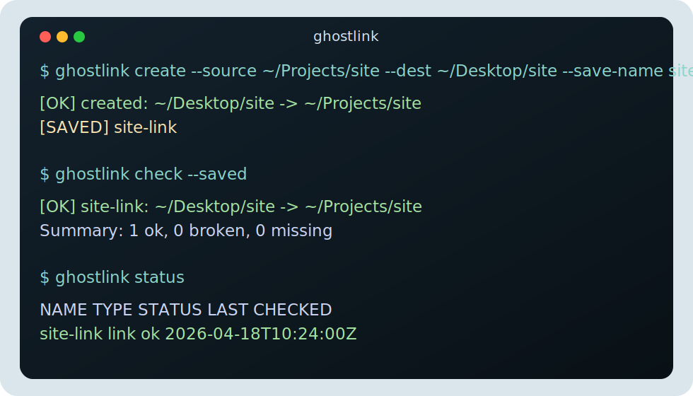

# ghostlink

**Create invisible links between your files**


`ghostlink` is a guided macOS CLI for working with symbolic links. It helps you create, inspect, repair, save, sync, and schedule link workflows without dropping straight to raw `ln -s` commands.

## What A Symlink Is

A symlink is a lightweight pointer to another file or folder.

- The link is not a copy of the target.
- Opening the link sends you to the real file or folder.
- If the target moves or disappears, the symlink becomes broken.

Example:

```text
~/Projects/site         # real folder
~/Desktop/site          # symlink pointing to that folder
```

That lets you keep one real copy of `site` while exposing it from multiple places.

## Why Use ghostlink

Symlinks are useful, but easy to get wrong by hand. `ghostlink` adds:

- guided prompts for one-off links
- dry-run previews before writing
- bulk creation from a file
- saved records you can check and repair later
- portable export/import files for rebuilding setups
- sync jobs and schedule metadata with visible status

Good fits:

- keep active project folders reachable from your desktop without duplication
- manage dotfiles or local tool folders with repeatable bulk files
- track important links and audit them later
- rebuild the same setup on a new machine

## Install

```bash
# from GitHub
pipx install git+https://github.com/alexsmedile/ghostlink

# or from a local clone
git clone https://github.com/alexsmedile/ghostlink
pipx install ./ghostlink
```

Compatibility commands remain available after install:

```bash
ghostlink --help
symlink-cli --help
slink --help
```

## Quick Start

```bash
# guided mode
ghostlink

# create one link with positional arguments
ghostlink ~/Projects/site ~/Desktop/site

# preview first
ghostlink ~/Projects/site ~/Desktop/site --dry-run

# create and save the record in one step
ghostlink create --source ~/Projects/site --dest ~/Desktop/site --save-name site-link -y
```

## Terminal Preview



## Common Examples

Create a link to a project folder:

```bash
ghostlink create --source ~/Projects/site --dest ~/Desktop/site
```

Build several links from a file:

```bash
ghostlink bulk links.txt --dry-run
ghostlink bulk links.txt -y
```

Check saved links later:

```bash
ghostlink check --saved
ghostlink repair --saved -y
ghostlink status
```

Export a setup and rebuild it elsewhere:

```bash
ghostlink export links.json --profile dev
ghostlink apply links.json --profile dev --save -y
```

Save and run a one-way sync job:

```bash
ghostlink sync save --name skills-sync --source ~/skills --dest ~/backup/skills
ghostlink sync diff skills-sync
ghostlink sync run skills-sync --dry-run
```

Preview a schedule for a saved job:

```bash
ghostlink schedule add skills-sync --every 30m --write
ghostlink schedule list
ghostlink schedule run skills-sync
```

## How ghostlink Remembers Data

`ghostlink` stores saved state in plain local files:

- registry: `~/.config/ghostlink/registry.json`
- run log: `~/.local/state/ghostlink/runs.jsonl`

The registry tracks saved links, saved sync jobs, schedules, and status fields such as:

- `last_status`
- `last_checked_at`
- `last_run_at`
- `last_exit_code`
- `last_message`

That is what powers commands like `ghostlink list`, `ghostlink show`, `ghostlink check --saved`, and `ghostlink status`.

## Docs

- [Commands reference](docs/commands.md)
- [Sync & schedules](docs/sync-and-schedules.md)
- [Relation sets (export/import)](docs/relation-sets.md)
- [Bulk file format](docs/bulk-format.md)
- [JSON output & exit codes](docs/json-and-exit-codes.md)
- [Safety & compatibility](docs/safety-and-compatibility.md)
- [Skill installation](docs/skill-installation.md)
- [Changelog](CHANGELOG.md)
- [Roadmap](ROADMAP.md)

## License

MIT
